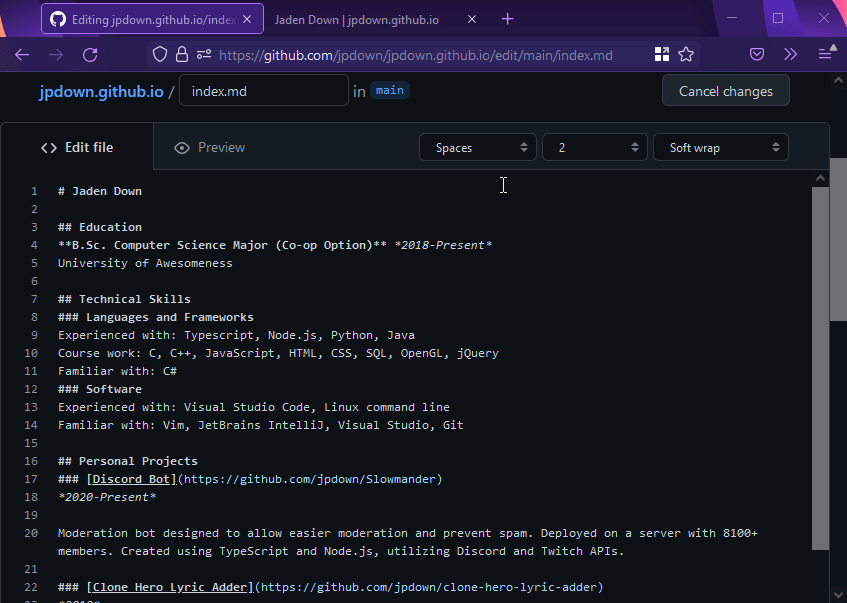

# Hosting a Resume on GitHub Pages

The goal of this README is to describe how to host a resume on GitHub Pages. It also aims to introduce principles of Andrew Etter's book [Modern Technical Writing][andrewetter].

## Prerequisites

* A Markdown editor
  * A list of editors is available in the [additional resources](#additional-resources)
* A resume, formatted in Markdown and named `index.md`
   * More information on Markdown is located under [Additional Resources](#additional-resources)
* A [GitHub](https://github.com) account
* Some free time

## Instructions

### Picking an Editor

To start, you will need to choose a Markdown editor. Markdown files can be edited in any text editor, but using a Markdown editor provides extra features like auto preview. I used [Visual Studio Code](https://code.visualstudio.com/) to write this guide. There is a list of Markdown editors in the [additional resources](#additional-resources).

### Writing Your Resume

We are using Markdown to write our resume. Markdown offers many benefits over a word processor. Markdown files are plain text, meaning they can be edited using any editor. It is also designed to be human readable, meaning more people can understand the formatting and make edits. The fact that Markdown is plain text also means it works great with version control systems like Git. There are links to Markdown guides and info under the [additional resources](#additional-resources).

### Hosting on GitHub

#### Why GitHub?
We are using GitHub Pages as our hosting for this guide. We use GitHub and Git as it provides many benefits for writing. Git is a decentralized version control, which means many people can work on the same project, and all the work can be merged together. Git also does not require an active internet connection to be used, only to push changes to servers like GitHub. Since it is version control, it also means you will have a history of all changes made.

#### Why Github Pages?
GitHub Pages is free to use and uses Jekyll in the background. Jekyll takes your Markdown files and generates a static website, consisting of portable HTML, CSS, and JS files. These files can then be deployed on any web server. This is beneficial as it means you can script the deployment of changes, allowing for smaller edits to be made more frequently. Thankfully, GitHub Pages handles this for us.

#### Steps
1. Go to the [GitHub homepage](https://github.com)
2. At the top right, click the + icon
3. Click "New respository"
4. Create a new public GitHub repository named "yourusername.github.io", where "yourusername" is your GitHub username
   * This is a special name that is used for your main GitHub Pages repository
   * The repository must be public for GitHub Pages to work
5. Add your resume to the repository
   1. If your repository has no files, click the link that says *uploading an existing file* in the blue *Quick setup* section.
   2. If your repository has files, click Add file next to the green *Code* button, and click *Upload files*
   3. Choose your resume named `index.md`
   4. Click the green *Commit changes* button
6. Go to *Settings* in the bar below your repository name
7. Go to *Pages* in the left pane
8. Ensure the *Source branch* is set to `main`

If all went well, in a few minutes, your resume should be available at https://yourusername.github.io. There will be a link at the top of the GitHub Pages settings.

### Theming

If you want to theme your site, GitHub Pages offers built in themes to choose from.

1. Go back to the GitHub Pages settings
2. Under Theme Chooser, click Choose a theme
3. Look through the options and choose your favorite theme
4. Click the green Select theme button

That's it! Now your resume is themed. For additional theming options, check out the [additional resources](#additional-resources). You can either use a premade theme or make your own. Jekyll provides many options for theming and templates.

### Updating Your Resume

Since we are using Markdown and GitHub Pages for our resume, making edits and deploying changes is easy. We simply need to edit the Markdown file in the repository and GitHub will automatically update the website. GitHub offers a simple web based editor for making quick edits.

1. Go to your repository
2. Open the file you wish to edit
3. Click the pencil icon
4. Make your changes
5. Under "Commit changes", change the commit message to explain what you changed
6. Click the green "Commit changes" button

The GitHub editor works for simple edits. For larger projects and bigger edits, you will want to use a Git client and edit locally. If you are using Jekyll directly, you will need to build your new website and deploy yourself. This is where scripting is very helpful.

## Additional Resources

### Modern Technical Writing
Andrew Etter's book, [Modern Technical Writing][andrewetter] goes into more detail on the modern writing process, and the benefits of markup languages and version control for writing. This is a great resource if you want to learn more about the full process, other tools, and techniques.

### Markdown
[This Markdown tutorial](https://www.markdowntutorial.com/) is interactive and walks you through the basics.  
[GitHub's documentation](https://guides.github.com/features/mastering-markdown/) goes into more detail on GitHub Flavored Markdown, which is what GitHub pages uses.  
[This list of Markdown editors](https://github.com/mundimark/awesome-markdown-editors) has a variety of editors, both online and desktop.

### Jekyll and Theming
[Jekyll's website](https://jekyllrb.com/) has all the documentation for using Jekyll directly.  
[The resources page](https://jekyllrb.com/resources/) on Jekyll's website links to external resources, including themes.

### Git Clients
The Git website has [a list of gui clients](https://git-scm.com/downloads/guis).  
GitHub has a [cheat sheet](https://training.github.com/downloads/github-git-cheat-sheet/) for using command line git.

## Authors and Acknowledgements

Thank you to Stewart Wilcox for providing the README template.
Thank you to Abu Yasin Sabik, Abdullah Al Noman, Muhammad Hasan Saleem, and Long Vu for peer editing.

## FAQs

### Why is Markdown better than a word processor?
Markdown is better than a word processor because the files are plain text. This allows the raw files to be understood by humans, and allows easier collaboration.

### Why is my resume not showing up?
If your resume is not showing up, ensure all of the following are true:
* Is the repository named `yourusername.github.io` where `yourusername` is your GitHub username?
* Is the name of your Markdown file `index.md`?
* Is your `index.md` located in the root of the repository, i.e., not in any folders?
* In the respository settings, in Pages, is the branch set to main?
* Does the GitHub Pages settings page say in a green box "Your site is published at https://yourusername.github.io/" near the top of the page?

[andrewetter]: https://www.amazon.ca/Modern-Technical-Writing-Introduction-Documentation-ebook/dp/B01A2QL9SS